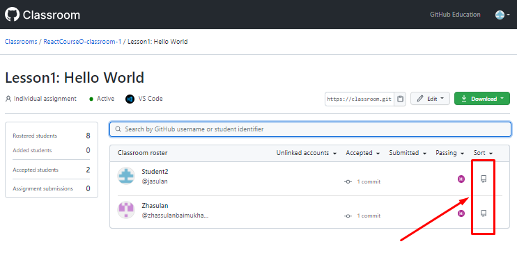
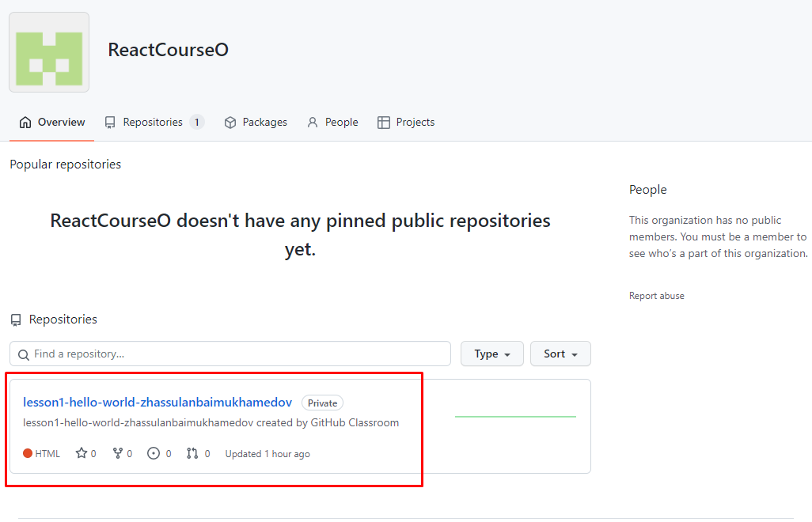

# Идея простая
#### Нужно организовать работу преподавателя и студентов, для проведения занятий. 
#### B это делается с помощью двух инструментов Github (https://github.com/), и GithubClassroom (https://classroom.github.com/).

 

  
